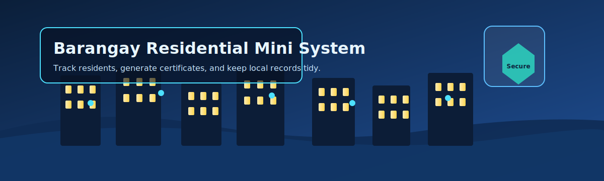

# Barangay Residential Mini System

- Java Swing desktop app for barangay record-keeping: residents, certificates, and reports.
- Built with NetBeans/Ant, targets Java 23 (`nbproject/project.properties`), and connects to MySQL via JDBC.
- Comes with a sample schema and data dump in `barangay_mini_system.sql` so you can run it locally fast.

## Features

- Resident registry with search/filter inside `home.java` and `resident.java`.
- Login gate (`login.java`) before accessing data.
- Auto-filled certificates (`Certificate.java`) and printable reports (`reports.java`).
- Dashboard counters for total residents and per-purok summary.
- MySQL-backed via `DBConnection.java` using Connector/J.

## Prerequisites

- JDK 23 (match `javac.source` / `javac.target` in `nbproject/project.properties`).
- MySQL 8.x server running locally.
- MySQL Connector/J JAR on the classpath (add to NetBeans Libraries or place in Ant `libs`).
- NetBeans 18+ (recommended) or Apache Ant 1.10+ for CLI builds.

## Setup (first run)

1. Create the database: `mysql -u root -p < barangay_mini_system.sql` (creates `barangay_mini_system` and tables).
2. Update database creds in `src/DBConnection.java` (`URL`, `USER`, `PASSWORD`).
3. Add Connector/J to the project libraries (NetBeans: Project Properties → Libraries → Add JAR/Folder).
4. Build & run:
   - NetBeans: Clean and Build, then Run Project.
   - CLI: `ant run` (uses `build.xml` / `nbproject/build-impl.xml`).

## Running & testing

- Default entry is `home` JFrame (launched by NetBeans run config).
- If the login form shows, use credentials present in your imported data or update the users table directly in MySQL.
- There are no automated tests; verify manually by adding a resident, generating a certificate, and exporting a report.

## Project layout

- `src/` Java sources and `.form` GUI builders.
- `barangay_mini_system.sql` database schema + seed data.
- `pictures/` images used inside the UI.
- `build.xml` Ant build; `nbproject/` NetBeans metadata.
- `readme-hero.svg` animated banner used above (kept local so it always renders on GitHub).

## Notes & tweaks

- If MySQL is on another host/port, adjust the JDBC URL in `src/DBConnection.java`.
- For production, move credentials to env vars or a config file instead of hardcoding.
- When exporting JARs, ensure the Connector/J JAR is bundled or on the runtime classpath.
- NetBeans form files (`*.form`) should stay paired with their `.java` counterparts to avoid GUI builder conflicts.
